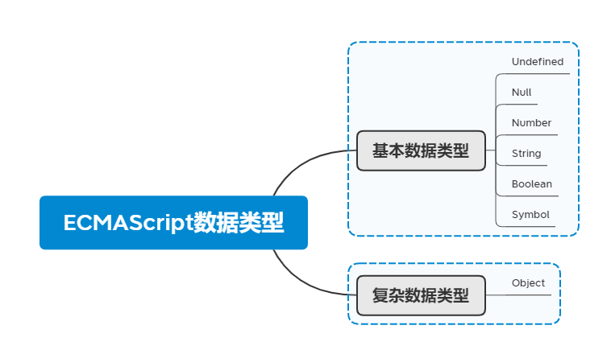

JavaScript推荐看两本书籍： **JavaScript高级程序设计**+**ES6标准入门（阮一峰）**

你可以每天2章+1章（具体情况要根据难度来进行调整哈）

## JavaScript的组成

JavaScript由三个部分组成：

1. ECMAScript：主要讲述语法
2. DOM：操作浏览器上面的页面元素的编程API，文档对象模型
3. BOM：用来操作浏览器自身窗口的编程API，浏览器对象模型

**DOM的理解**：通过DOM创建的这个表示文档的树形图，开发人员获得了控制页面内容和结构的主动权。借助DOM提供的API,开发人员可以轻松自如地删除、添加、替换或修改任何节点。

JavaScript是一种专为与网页交互而设计的脚本语言，由下列三个不同的部分组成:

1. ECMAScript,提供核心语言功能;
2. 文档对象模型(DOM),提供访问和操作网页内容的方法和接口;
3. 浏览器对象模型( BOM),提供与浏览器交互的方法和接口。

**ECMAScript数据类型**



ECMAScript变量可以分为**基本类型值**和**引用类型值**。

**复制变量值的不同处理方式**

对于基本类型值来说，复制变量之后的两个变量之间是互相不影响的，产生的是两个**独立**的变量。

对于引用类型值来说，复制操作结束后，两个变量将**引用同一个对象**。改变其中一个变量，都会影响另外一个变量。因为这两个变量引用的是同一个对象。

**传递参数**

ECMAScript中所有函数的参数都是按值传递的。也就是参数的传递实际上是在复制变量值，基本类型和引用类型分别按照各自复制变量的方法来对函数的参数进行传递。即基本类型的参数传递不会影响到外部的变量，而引用类型的参数传递的变化会反映在函数外部。

补充：**基本类型值保存在栈内存中，引用类型值保存在堆内存中。**

**延长作用域链**

在ES5中，只有两种全局作用域和局部作用域（函数）。

但是我们有其他的方法来延长作用域链。

**JavaScript具有自定垃圾回收机制**

找出不再继续使用的变量（垃圾收集器必须跟踪某一个变量是否有用，对于不再使用的变量打上标记），然后释放其占有的内存。垃圾收集器会按照固定的时间间隔周期的执行这一操作。

**引用类型**

构造函数本身是一个函数，只不过该函数是出于创建新对象的目的而定义的。

Object、Array、Date、Function、基本包装类型、单体内置对象、Math、

数组的栈方法：push（）和pop（）方法

push（）方法：添加任意数量的元素到数组末尾（栈顶），返回修改后数组的长度。

pop（）方法：删除数组的末尾元素（栈顶），返回被移除的项。

结合push（）方法和pop（）方法，可以像栈一样使用数组。

数组的队列方法：shift（）和push（）方法

shift（）方法：移除数组中的第一个元素，并返回该元素。

结合shift（）和push（）方法，可以像队列一样使用数组。

unshift（）方法：在数组前端添加任意个元素并返回修改后数组的长度。

**函数声明与函数表达式**

解析器在向执行环境中加载数据时，对函数声明和函数表达式的处理是不一样的。

解析器会率先读取函数声明，并使其在执行任何代码之前可用。

至于函数表达式，则必须等到解析器执行到它所在的代码行，才会真正被解释执行。

**作为值的函数**

因为ECMAScript中的函数名本身就是变量，所以函数也可以作为值来使用。即函数名可以作为一个参数来传递，也可以作为另一个函数的返回结果。

**面向对象的程序设计**

1. 理解对象属性

2. 理解并创建对象

   1. 工厂模式：用函数来封装以特定接口创建对象的细节。

      ```javascript
      function createObject(name,age) {
          var person=new Object();
          person.name=name;
          person.age=age;
          return person;
      }
      var p1=createObject('刘媛媛',11);
      console.log(p1.name);
      ```

      优点：可以无数次的调用这个函数。

      缺点：没有解决对象识别的问题。

   2. 构造函数模式：（可以分为原生构造函数和自定义的构造函数）

      ```javascript
      function Person(name,age,height) {
          this.name=name;
          this.age=age;
          this.height=height;
      }
      var pp1=new Person('秦始皇',13,187);
      var pp2=new Person('香赵王',75,180);
      console.log(pp1.name);
      ```

      构造函数本身也是函数，只不过可以用来创建对象而已。构造函数与其他函数的唯一区别，就在于调用它们的方式不同。

      **使用new关键字会经历的4个步骤：**

      1. 创建一个新对象；
      2. 将构造函数的作用域给新对象（因此this就指向了这个新对象）；
      3. 执行构造函数中的代码（为这个新对象添加属性）；
      4. 返回新对象。

      构造函数模式的缺点：每个方法都要在每个实例上重新创建一遍。

   3. 原型模型

      我们我们创建的每个函数都有一个prototype（原型）属性，这个属性指向一个对象，该对象的用途是包含可以由特定类型的所有实例共享的属性和方法，即是原型对象。原型对象的好处是可以让所有对象实例共享它所包含的属性和方法。即不必在构造函数中定义对象实例的信息，而是可以将这些信息直接添加到原型对象中。

      ```javascript
      //原型模型
      function Dog() {
      
      }
      Dog.prototype.name='小白';
      Dog.age=12;
      Dog.prototype.sayName=function () {
          console.log(this.name)
      };
      var d1=new Dog();
      var d2=new Dog();
      d1.sayName();
      console.log(d1.age==d2.age);
      ```

      缺点：共享性质使对象属性会存在问题。

      原型与in操作符**

      in操作符的使用有两种方式：**单独使用**和在**for-in循环**中使用。

      in单独使用：in操作符无论该属性存在于实例还是原型中，都返回true。

      for-in循环：返回的是所有能够通过对象访问的、可枚举（enumerated）属性，其中包括存在于实例中的属性，也包括存在于原型中的属性。（这里有点问题）。

      **原型的动态性**

      我们对原型对象所做的任何修改都能够立即从实例上反映出来，即使是先创建了实例后修改原型也照样如此。

      ```javascript
      //原型的动态性
      var ming=new Person('小米',1997,190);
      Person.prototype.sayHi=function () {
          console.log(this.name);
      };
      ming.sayHi();//小米  
      ```

      尽管可以随时为原型添加属性和方法，并且修改能够立即在所有对象实例中反映出来，但如果是重写整个原型对象，那么情况就不一样了，把原型修改为另外一个对象就等于切断了构造函数与最初原型之间的联系。

   4. 组合使用构造函数模式和原型模式

      **创建自定义类型的最常见方式，是组合使用构造函数模式与原型模式。**

      构造函数模式用于定义实例属性，原型模式用于定义方法和共享的属性。

      ```javascript
      //组合使用构造函数模式和原型模型来创建对象
      //构造函数用于定义实例属性
      function Cat(name,age,weight) {
          this.name=name;
          this.age=age;
          this.weight=weight;
      }
      //原型模式用于定义你方法和共享的属性
      Cat.prototype.sayName=function () {
          console.log(this.name);
      };
      var c1=new Cat('花花',12,120);
      var c2=new Cat('小黑',13,130);
      c1.sayName();
      c2.sayName();
      ```

      这种构造函数与原型混成的模式，是目前在ECMAScript中使用最广泛、认同度最高的一种创建自定义类型的方法。可以说，这是用来定义引用类型的一种默认模式。

3. 继承

   实现继承主要是依靠**原型链**来实现的。基本思想是利用原型让一个引用类型继承另一个类型的属性和方法。

   **原型链**

**函数表达式**

定义函数的方式有两种：一是函数声明；二是函数表达式（匿名函数）。

函数声明，它的一个重要特征就是函数声明提升，即在执行代码之前会先读取函数声明。

函数表达式则没有函数声明提升的特征，即函数表达式与其他表达式一样，在使用前必须先赋值。

1. 闭包

   闭包是指有权访问另一个函数作用域中的变量的函数。创建闭包的常见方式，就是在一个函数内部创建另一个函数。

   在另一个函数内部定义的函数会将包含函数（即外部函数）的活动对象添加到它的作用域中。

   即当外部函数执行完毕后，其执行环境的作用域链就会被销毁，但它的活动对象仍然会留在内存中；知道匿名函数被销毁后，外部函数的活动对象才会被销毁。

   闭包保存的是整个变量对象，而不是某个特殊的变量。

   **闭包中的this**：

**BOM**

控制窗口、框架和弹出窗口。用于访问浏览器的功能，这些功能与任何网页内容无关。

BOM的核心对象是**window**，它表示浏览器的一个实例，是通过JavaScript访问浏览器窗口的一个接口，在全局作用域中声明的变量、函数都会变成window对象的属性和方法。

1. window.open()方法：既可以导航到一个特定的URL，也可以打开一个新的浏览器窗口。
2. 间歇调用和超时调用
3. 系统对话框：alert（）、confirm（）、prompt（）
4. location对象：其中window.location和document.location引用的是同一个对象。主要是网址那一块，哪一个网页。
5. navigator对象：识别客户端浏览器的事实标准。
6. history对象：保存用户上网的历史记录。使用go（）方法可以在用户的历史记录中任意跳转，可以向前也可以前后。

**DOM**

DOM是针对HTML和XML文档的一个API，应用程序编程接口。DOM描绘了一个层次化的节点树，允许开发人员添加、移除和修改页面的某一部分。可以对页面的结构、内容和样式进行修改。

1. Node类型

   

2. document对象是window对象的一个属性，因此可以将其作为全局对象来访问。

**事件**

JavaScript与HTML之间的交互是通过事件实现的。

事件冒泡：事件开始时由最具体是元素接收，然后逐级向上传播到较为不具体的节点。

事件捕获：不太具体的节点应该更早接收到事件，而最具体的节点应该最后接收到事件，在事件到达预定目标之前捕获它。

在触发DOM上的某个事件时，会产生一个事件对象event，这个对象中包含着所有与事件有关的信息。

**事件类型**

UI事件：当用户与页面上的元素交互时触发。

焦点事件：当元素获得或失去焦点时触发。

鼠标事件：当用户通过在页面上执行操作时触发。

滚轮事件：当使用鼠标滚轮时触发。

文本事件：当在文档中输入文本时触发。

键盘事件：当用户通过键盘在页面上执行操作时触发。

**表单脚本**

**JSON**


1. json中没有变量的概念，json中的对象必须加双引号，这是在json中必需的。

2. json中没有分号，且必须使用的是双引号，不能使用单引号。

3. json只是一种数据格式，不是一种编程语言。

   **解析与序列化**

   可以把json数据结构解析为有用的JavaScript对象。

   json对象有两个方法：stringify（）和parse（）。

   stringify（）：用于把JavaScript对象序列化为json字符串。

   parse（）：用于把json字符串解析为原生的JavaScript值。


